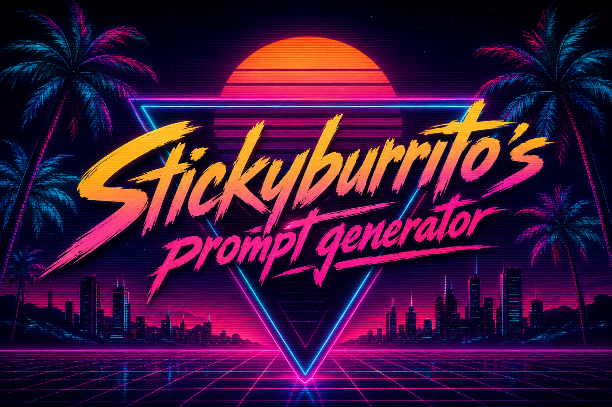

<p align="center">
  
</p>

<h1 align="center">Stickyburrito’s Prompt Generator</h1>

<p align="center">
  Turn an idea into a detailed, editable image or video prompt using private local AI.
</p>

<p align="center">
  <a href="https://github.com/StickyBurrito/stickyburritos-prompt-builder/releases/latest/download/Stickyburritos-Prompt-Generator-Setup.exe"></a>
  <a href="https://github.com/StickyBurrito/stickyburritos-prompt-builder/releases/latest"></a>
  <a href="https://paypal.me/StickyBurrito"></a>
</p>

## Install it

1. Download **Stickyburritos-Prompt-Generator-Setup.exe** from the [latest release](https://github.com/StickyBurrito/stickyburritos-prompt-builder/releases/latest).
2. Run the installer and select how much graphics memory your PC has.
3. Accept the recommended local model package or choose another tier.
4. Choose the installation folder and press **Install Prompt Generator**.
5. The installer opens the generator when everything is ready.

The installer handles the whole local stack. It can install or update Ollama, download the selected text and vision models, configure the generator, create shortcuts, and register a proper Windows uninstaller. The progress bar shows the current stage, percentage, and estimated time remaining.

> The installer is currently unsigned. Windows SmartScreen may show an **Unknown publisher** warning.

## What it can do

- **Local prompt interviews** — Ollama asks five focused questions at a time and can continue toward 100 distinct details. Skipped questions stay skipped.
- **Danbooru and Pony V6 XL** — Generates ordered booru tags, Pony score/source/rating tags, negative prompts, and camera variants for ComfyUI.
- **Krea 2** — Produces faithful, cohesive natural-language prompts based on the [official Krea 2 prompting guidance](https://github.com/krea-ai/krea-2/blob/main/docs/prompting.md), with photorealism as the default when no other medium is selected.
- **MiniMax H3 T2V** — Builds production-style video prompts with timed scenes, camera movement, character movement, emotion, transitions, dialogue, sound, and music.
- **MiniMax H3 I2V** — Upload a first frame, analyze it locally with a vision model, and create motion that begins from the actual image composition.
- **Cumulative refinement** — Tell the generator what worked or what should change. Earlier refinements remain part of later regenerations.
- **Editable results** — Adjust tags, prompt text, negative prompts, scene timings, variants, camera choices, poses, locations, interactions, and other controls.
- **Automatic regeneration** — Changing a relevant prompt control immediately rebuilds an existing result.
- **Optional NSFW direction** — Steers interviews and prompt wording toward adult content when enabled.
- **Reasoning controls** — Choose faster generation or show the local model’s available reasoning output.
- **Fresh inspiration** — Prompt starters are generated locally by Ollama instead of using the same three examples forever.

## Prompt modes

| Mode | Best for | Output |
| --- | --- | --- |
| Danbooru tags | Booru-captioned ComfyUI checkpoints | Ordered positive tags, negative prompt, variants |
| Pony Diffusion V6 XL | Pony-based ComfyUI workflows | Pony score/source/rating tags and full variants |
| Krea 2 image | Krea image generation and photoreal concepts | Detailed natural-language image prompts |
| MiniMax H3 T2V | Text-to-video generation | Timed audiovisual scene prompt |
| MiniMax H3 I2V | Animating an uploaded first frame | Local image analysis plus timed audiovisual motion prompt |

## Model packages

Setup recommends a package from the selected VRAM amount. Download sizes are approximate and may change when upstream models are updated.

| Selected VRAM | Package | Approximate download |
| --- | --- | ---: |
| 4–5 GB | Compact text + vision | 3.3 GB |
| 6–11 GB | Balanced text + vision | 6.1 GB |
| 12–15 GB | Compact Qwen 3.6 + 8B vision | 19 GB |
| 16–23 GB | Recommended Qwen 3.6 + 8B vision | 21 GB |
| 24–31 GB | High-quality text + 30B vision | 39 GB |
| 32 GB+ | Stable text + maximum vision | 36 GB |

You can override the recommendation before installation. More VRAM does not remove the need for enough free disk space.

## Privacy and connectivity

Prompt interviews, image analysis, reasoning, and prompt generation go through Ollama on `127.0.0.1` and stay on your computer. The app does not send your prompt to an external AI service.

Internet access is still used when setup downloads Ollama and local models. Optional Danbooru autocomplete queries Danbooru directly and silently falls back when unavailable.

## Uninstall

Use either method:

- Open the setup program again and choose **Uninstall**.
- Open **Windows Settings → Apps → Installed apps**, find Stickyburrito’s Prompt Generator, and choose **Uninstall**.

Uninstall removes the generator, local generator settings, and shortcuts. Ollama and its downloaded models are deliberately preserved because other local applications may use them.

## For developers

Most people only need the installer. The source is included for anyone who wants to modify or build the generator.

### Visual Studio

Open `TagRoll.slnx` in Visual Studio 2026, select **TagRoll.Web**, and press **F5**. The ASP.NET Core project serves the interface at `http://localhost:8765` and connects to Ollama at `127.0.0.1:11434`.

The solution targets .NET 10. Ollama’s endpoint, default text model, vision model, and timeout are configurable in `TagRoll.Web/appsettings.json`.

### Build the installer

Run `build-installer.ps1`. The finished self-contained installer is written to:

```text
artifacts/installer/Stickyburritos-Prompt-Generator-Setup.exe
```

The installed root contains one launcher executable with organized `App` and `Web` folders underneath it.

### Rules-only fallback

Open `index.html` directly and select **Built-in rules** to use the non-AI fallback without Ollama. Vocabulary and checkpoint-specific conventions live in `app.js`.
